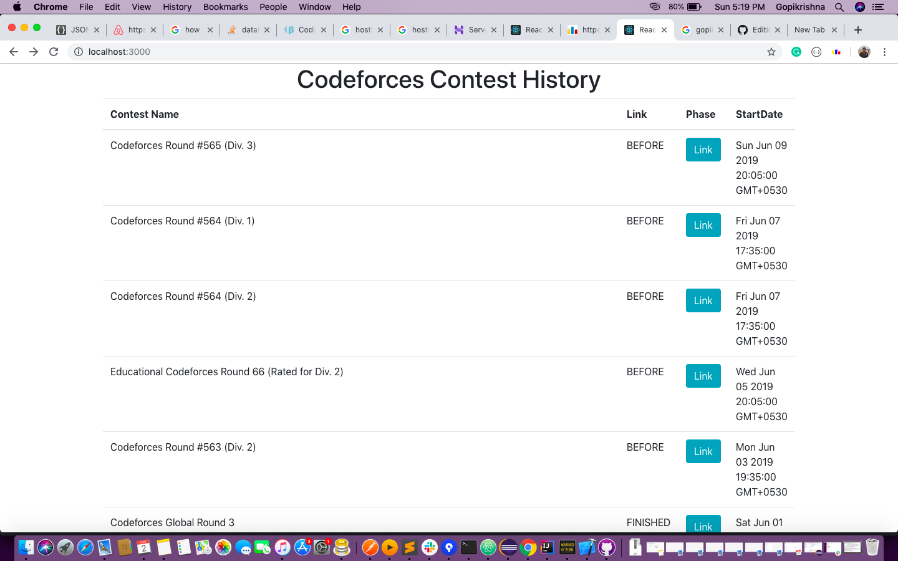

Codeforces Contests Fetcher




Software Used <br/>1.React js <br/>2.bootstrap<br/> 3.HTML<br/> 4.CSS <br/>5.React router DOM(For routing purpuse)<br/>

#Steps to follow<br/>
1.Install npm and Nodejs```sudo apt install nodejs sudo apt install npm```<br/>
2.Install bootstrap  ```npm intall --save react-boostrap ```<br/>
3.Install react-router-dom (for routing purpuse) ```npm install --save react-router-dom```<br/>
4.Create react app ```npx create-react-app my-app``` <br/>
5.Delete src and public directories from ```my-app``` folder <br/>
6.Clone this repository and copy the public and src repositories to ```my-app``` <br/>
6.GO inside of my-app through the cmd and start server ```npm start``` <br/>

You are done ......:)
